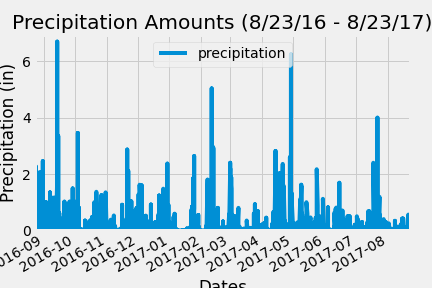
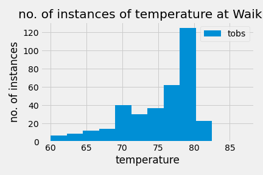

# sqlalchemy-challenge

## Background
In this challenge, I was tasked with analyzing climate data for the state of Hawaii. There were two major elements, *Climate Analysis and Exploration* and the *Climate app*.

## Climate Analysis and Exploration
The code for the Climate Analysis and Exploration can be found in [climate.ipynb](climate.ipynb)
### Precipitation Analysis:

### Station Analysis:

## Climate App:
Code for the climate app can be found in [app.py](app.py). Run the program and go to http://127.0.0.1:5000 to view the results.

## Bonus Analysis:
Code for bonus challenge #1 can be found in [temp_analysis_bonus_1](temp_analysis_bonus_1.ipynb). In the bonus I create a datafame whose index is the date column, and whose dates are formatted as datetime, as well as running an unpaired t-test to compare the mean temperatures of Hawaii in June and December.